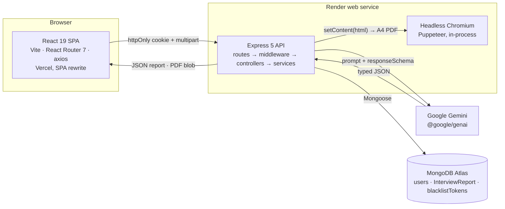
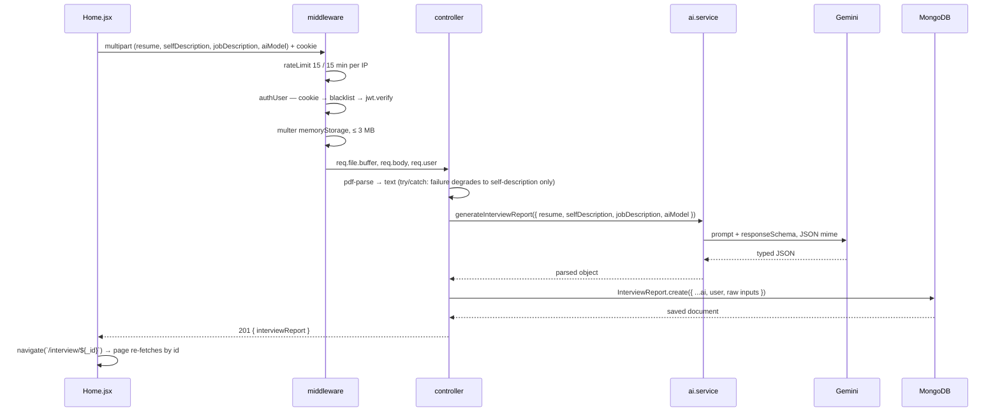
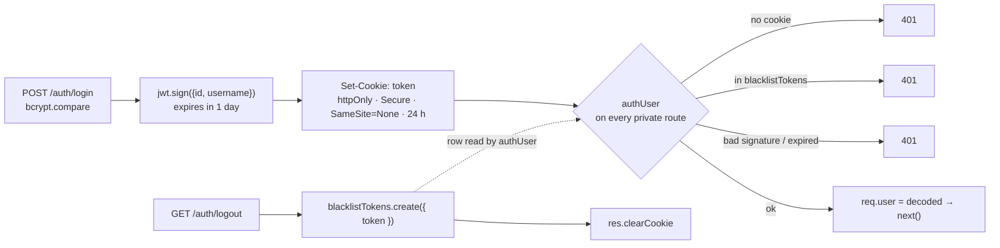
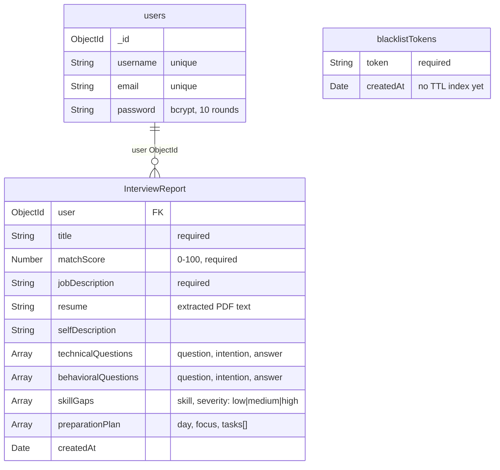

# Architecture — Interview AI Master

A MERN application that turns a résumé PDF and a job description into a typed *interview report*
(match score, 20+ technical and 10 behavioural questions with intentions and model answers,
severity-ranked skill gaps, a 14-day plan), and re-writes the résumé against that job description
as a one-page ATS PDF.

The defining constraint of the system: **the model's output is a database document, not a chat
reply.** Every AI call is issued with `responseMimeType: "application/json"` and a declared
`responseSchema`, and Mongoose is the second gate behind it.

---

## 1. System context



The browser never talks to Gemini or Mongo. `GOOGLE_GENAI_API_KEY`, `MONGO_URI` and `JWT_SECRET`
exist only in the API process environment.

---

## 2. Module map

```
Backend/
  server.js                    dotenv → connectToDB() → app.listen(3000)
  puppeteer.config.js          pins the Chromium download into ./.cache/puppeteer
  src/
    app.js                     express · cookie-parser · CORS allow-list · trust proxy · mounts routes
    config/database.js         mongoose.connect(MONGO_URI)
    middlewares/
      auth.middleware.js       authUser: cookie → blacklist lookup → jwt.verify → req.user
      file.middleware.js       multer memoryStorage, 3 MB limit
    routes/
      auth.routes.js           /api/auth       · 4 endpoints
      interview.routes.js      /api/interview  · 4 endpoints + rate limiter
    controllers/
      auth.controller.js       register · login · logout · getMe
      interview.controller.js  generate report · get by id · list · generate résumé PDF
    models/
      user.model.js            users
      interviewReport.model.js InterviewReport + 4 embedded sub-schemas
      blacklist.model.js       blacklistTokens
    services/
      ai.service.js            response schema · both prompts · Gemini calls · HTML → PDF

Frontend/src/
  App.jsx                      AuthProvider → InterviewProvider → RouterProvider
  app.routes.jsx               4 routes, 2 wrapped in <Protected>
  features/auth/               context · hooks/useAuth · services/auth.api · components/Protected · pages
  features/interview/          context · hooks/useInterview · services/interview.api · pages
```

**Layer contract.** Controllers never import the Gemini SDK; services never touch `req`/`res` or the
database. That boundary is what makes the controllers unit-testable with the AI layer stubbed.

---

## 3. Request pipeline — `POST /api/interview/`



Failure modes: `429` rate limit (special-cased in the UI), `401` auth, multer size error,
silent PDF-parse degradation, Gemini errors, and Mongoose `ValidationError` when the model returns
a score outside 0–100 or a severity outside the enum.

---

## 4. Authentication

JWT in an `httpOnly` cookie plus a server-side blacklist so logout is immediate.



The SPA and API are on different sites (Vercel / Render), so the cookie **must** be
`SameSite=None; Secure`; that in turn requires `app.set('trust proxy', 1)` behind Render's TLS
terminator and an explicit CORS allow-list with `credentials: true` (a wildcard origin is illegal
with credentials).

---

## 5. Data model



The report is deliberately denormalised — raw inputs and the whole generated strategy live in one
document, so the report page is a single `findById` with no population. The cost is that the list
endpoint has to project the heavy fields away:
`select("-resume -selfDescription -jobDescription -technicalQuestions -behavioralQuestions -skillGaps -preparationPlan -__v")`.

---

## 6. API surface

| Method & path | Access | Middleware | Input | Success |
| --- | --- | --- | --- | --- |
| `POST /api/auth/register` | public | — | username, email, password | `201` + Set-Cookie |
| `POST /api/auth/login` | public | — | email, password | `201` + Set-Cookie |
| `GET /api/auth/logout` | public | — | cookie | `200`, token blacklisted |
| `GET /api/auth/get-me` | private | `authUser` | cookie | `200` { id, username, email } |
| `POST /api/interview/` | private | `rateLimit` → `authUser` → `upload.single("resume")` | multipart: resume ≤3 MB, selfDescription, jobDescription, aiModel | `201` { interviewReport } |
| `GET /api/interview/` | private | `authUser` | — | `200` list, newest first, projected |
| `GET /api/interview/report/:interviewId` | private | `authUser` | path param | `200` full report |
| `POST /api/interview/resume/pdf/:interviewId` | private | `rateLimit` → `authUser` | path param + `?aiModel=` | `200` `application/pdf` |

---

## 7. AI layer

`ai.service.js` is the only module that knows Gemini exists. It exports two functions.

**`generateInterviewReport`** — one prompt (expert interviewer / recruiter / career coach) with the
three inputs interpolated, asking for a realistic score, ≥20 technical and ≥10 behavioural questions
each with an *intention* and a model answer, severity-graded skill gaps, and a 14-day plan. Issued
with a six-property `responseSchema`, all required.

**`generateResumePdf`** — asks for a complete inline-CSS HTML document under five anti-hallucination
rules (extract the real name from the top of the résumé text; copy contact details exactly; omit
missing details rather than inventing them; no `<script>`; no trailing whitespace) plus the exact
container, heading, divider and flex-row CSS, with a 210 × 297 mm wrapper to force one page. The
response is `{ resumePdf: STRING }`; markdown fences are stripped before `JSON.parse`, and the HTML
goes to `page.setContent` (45 s timeout) then `page.pdf({ format: "A4", margin: 15/10 mm })`.
Chromium is launched and closed per request in a `finally` block, with
`--no-sandbox --disable-dev-shm-usage --single-process`.

The model name is chosen in the UI, stored in `InterviewContext`, and passed through as a form field
(report) or `?aiModel=` query param (PDF).

---

## 8. Frontend

Feature-sliced — each feature owns its context, hook, API client, pages and styles. No Redux, no
data-fetching library.

| Route | Guard | Page |
| --- | --- | --- |
| `/login`, `/register` | public | auth forms |
| `/` | `Protected` | Home — JD + résumé/self-description + model picker + history |
| `/interview/:interviewId` | `Protected` | Interview — technical / behavioural / roadmap / résumé tabs |

State: `AuthContext` holds `{ user, loading }`; `InterviewContext` holds
`{ report, reports, loading, selectedModel }`. `Protected` is the only auth-aware component —
spinner while loading, `<Navigate to="/login">` when there is no user, children otherwise.
Both axios instances are created with `withCredentials: true`.

---

## 9. Deployment & configuration

| Piece | Target | Notes |
| --- | --- | --- |
| SPA | Vercel | `vercel.json` rewrites all paths to `/index.html` so `/interview/:id` survives a refresh |
| API | Render | port hardcoded to 3000 in `server.js`; `trust proxy = 1` |
| Database | MongoDB Atlas | single connection at boot; failure is logged, not fatal |
| Chromium | inside the API container | `puppeteer.config.js` pins the cache dir so the binary survives the build |

Environment variables actually read by the code: **`MONGO_URI`**, **`JWT_SECRET`**,
**`GOOGLE_GENAI_API_KEY`**. (The README's `PORT` and `GEMINI_API_KEY` are stale — neither is read.)

---

## 10. Design decisions & trade-offs

| Decision | Why | What it costs |
| --- | --- | --- |
| Schema-constrained JSON from Gemini | output is a DB document; `JSON.parse` is safe; models are swappable | the contract is declared twice (response schema + Mongoose) and can drift |
| Puppeteer HTML → PDF | layout becomes a prompt, not coordinate code | Chromium in the API container; per-request launch; model-authored markup |
| JWT in an httpOnly cookie | unreadable by page scripts, attached automatically | cross-site cookie rules, CORS allow-list, CSRF to handle |
| Server-side blacklist | immediate logout in ~20 lines | one DB read per authenticated request; unbounded growth |
| `multer.memoryStorage()` | the PDF is needed for exactly one parse; nothing to clean up | 3 MB cap; concurrent uploads sit in memory |
| Store extracted résumé text on the report | regenerate a tailored résumé later, from any device | résumé text duplicated per report |
| Model choice sent from the client | quality/latency becomes a user dial | an arbitrary string reaches the SDK |
| Context + hooks | 4 routes, 2 entities — a store would be overhead | no request dedupe (hence duplicate `getMe`) |

---

## 11. Known gaps / roadmap

1. **Broken object-level authorisation (high).** `getInterviewReportById` and the PDF route look up by
   id only — any authenticated user can read any report, résumé text included. Fix:
   `findOne({ _id: interviewId, user: req.user.id })`.
2. **Unsanitised model-authored HTML (high).** The prompt forbids `<script>`; nothing enforces it
   before `page.setContent`. Sanitise server-side and disable JS on the page.
3. **Blacklist has no TTL index (medium).** Add one at 24 h on `createdAt`.
4. **No global error handler (medium).** Add terminal `(err, req, res, next)` JSON middleware with a
   `ValidationError` branch.
5. **Unvalidated `aiModel` (medium).** Allow-list the three supported models.
6. **No input validation (medium).** `zod` and `zod-to-json-schema` are installed but unused — define
   schemas once and derive the Gemini `responseSchema` from them.
7. **Chromium per request (medium).** Reuse a browser instance or move PDF rendering to a worker.
8. **Duplicate `getMe` (low).** Move the bootstrap effect from `useAuth` into `AuthProvider`.
9. **Silent auth failures (low).** `useAuth` catch blocks are empty — surface an `error` value.
10. **Default model divergence (low).** `Home.jsx` starts at `gemini-3.5-flash`; context and server
    fall back to `gemini-3.1-flash-lite`. Use one exported constant.
11. **No pagination** on the report list (the UI slices to 12) and object URLs are never revoked.
12. **No tests.** `npm test` is still the placeholder — controllers with the AI layer stubbed,
    contract tests over recorded Gemini responses, and route tests on an in-memory MongoDB.

**If it had to scale:** make generation asynchronous (`202` + job id), split the PDF renderer into
its own worker, cache by hash of (résumé, job description), move the rate limiter behind `authUser`
and key it on user id, and add a compound index on `{ user: 1, createdAt: -1 }`.
